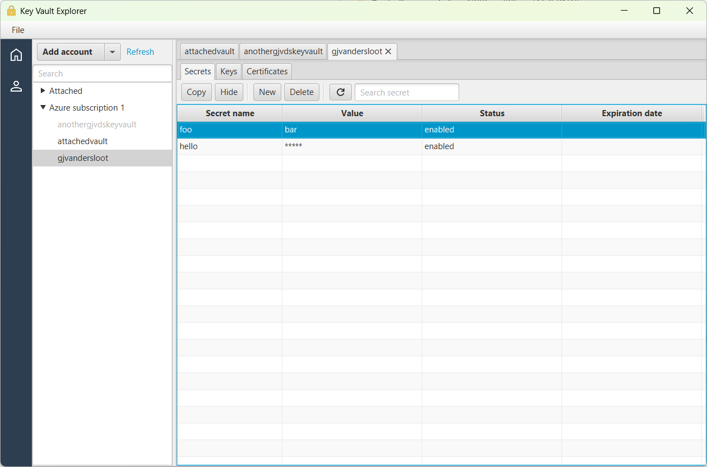
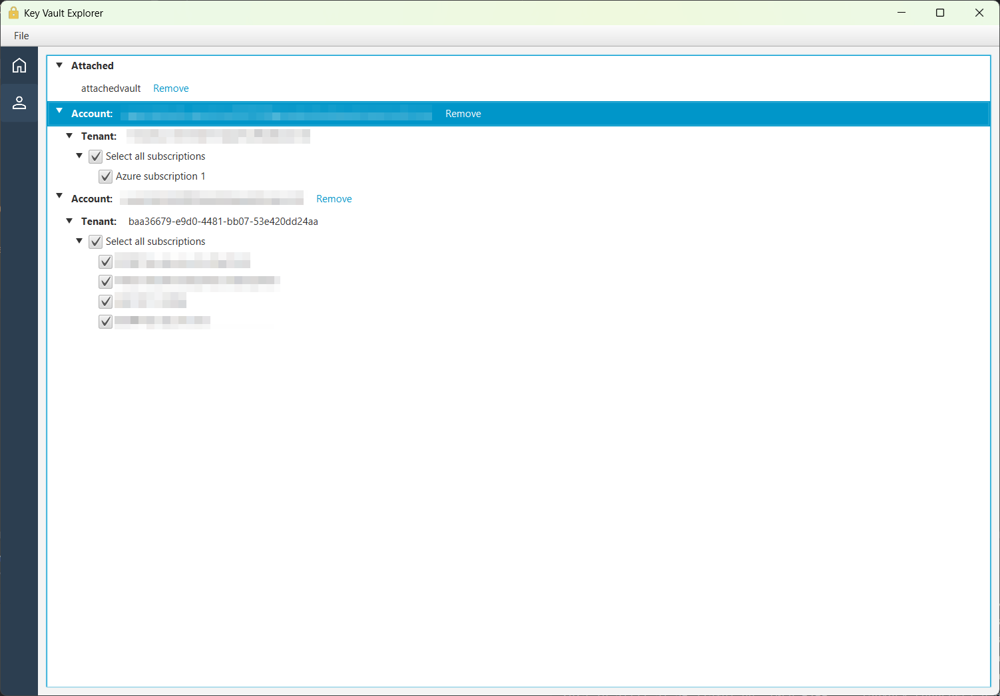
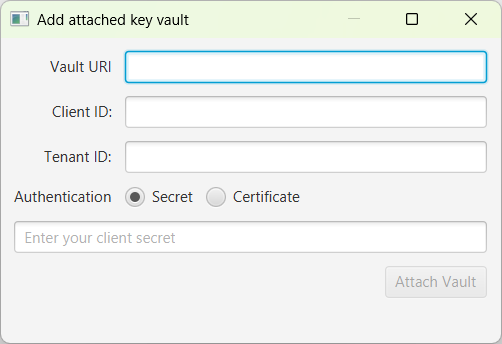

# 🔐 Azure Key Vault Explorer

A lightweight **Azure Key Vault explorer** built with **JavaFX**, **Spring Boot**, and the **Azure SDK for Java**.  
Browse, filter, and manage secrets and keys from your Azure Key Vaults through a simple desktop interface.

---

## ✨ Features

- 🗝️ **Explore** secrets, keys, and certificates stored in Azure Key Vault
- 🔎 **Search and filter** by name or tag
- 📋 **Copy** secret values or key metadata with a single click
- 🔁 **Refresh** vault content dynamically
- ⚙️ **Supports multiple authentication methods**
    - Interactive login (Microsoft Entra ID)
    - Client ID + Secret
    - Client ID + Certificate

|  |  |
|-----------------------------|--------------------------|
|   |                          |

## 🚀 Getting Started

### Prerequisites
- Java 21 or later
- Maven or Gradle
- An active Azure subscription and Key Vault

### Clone and Run

```bash
git clone https://github.com/Gjvdsloot/AzKeyVaultExplorer.git
cd AzKeyVaultExplorer
gradlew run
```

